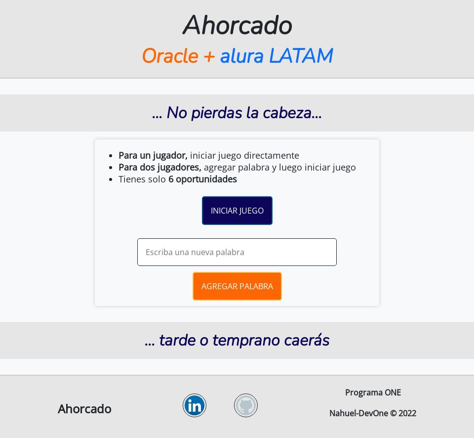
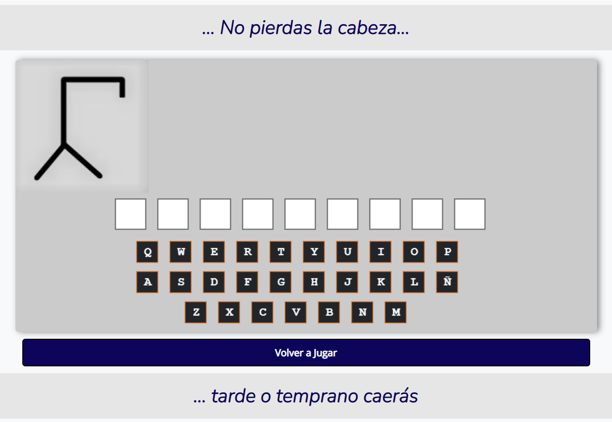
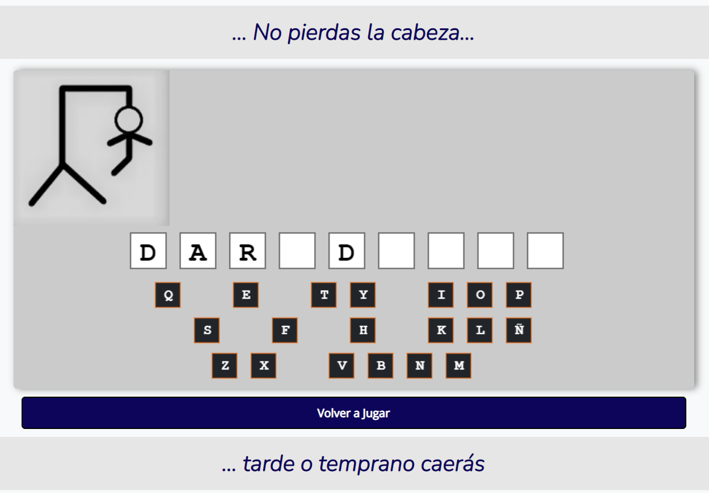
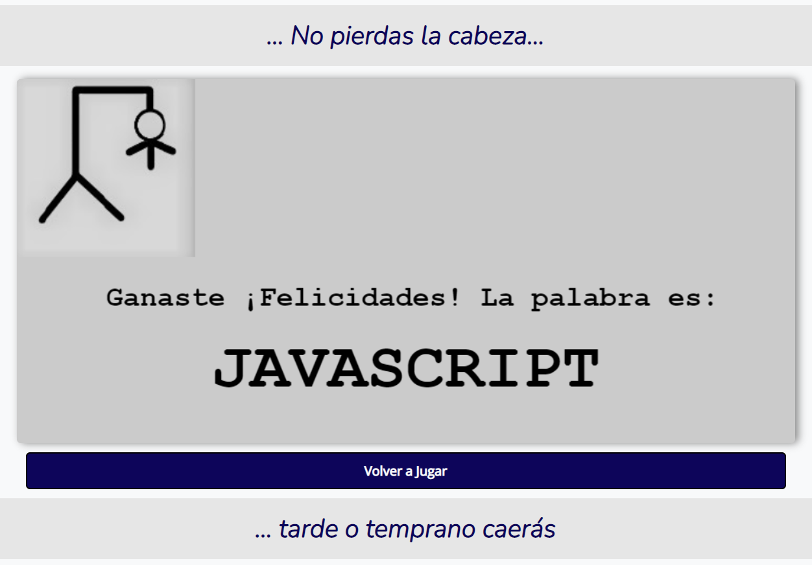
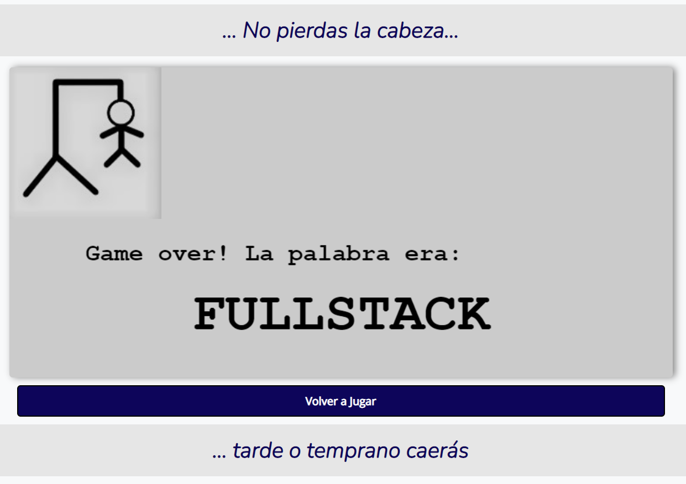

# **Juego del ahorcado - JavaScript** 
# *Programa ONE*
### **Nahuel-DevOne**

# *Información del proyecto:*

Este es mi segundo proyecto para el programa ONE de Oracle + Alura LATAM, que forma parte del programa principiante en programación.  
Consiste en el famoso juego del ahorcado, hecho con HTML5, CSS y JavaScript. No usé ningún framework de CSS porque quería maquetar únicamente usando CSS. Como editor de texto usé VSC, y fuentes de google fonts para las letras.

## *Version 1.0.0:*

- 

## *Capturas:*

### 1. inicio:
## 

### 2. juego:
## 

### 3. juego:
## 

### 4. Victoria:
## 

### 5. Derrota:
## 

## *Desarrollado con:*

- [Visual Studio Code](https://code.visualstudio.com/)
- [HTML5](https://developer.mozilla.org/es/docs/Glossary/HTML5)
- [CSS](https://developer.mozilla.org/es/docs/Web/CSS)
- [JavaScript](https://developer.mozilla.org/es/docs/Web/JavaScript)

#### *¡Thanks a lot for reading me!* _Yours sincerely_... "**DevOne**".